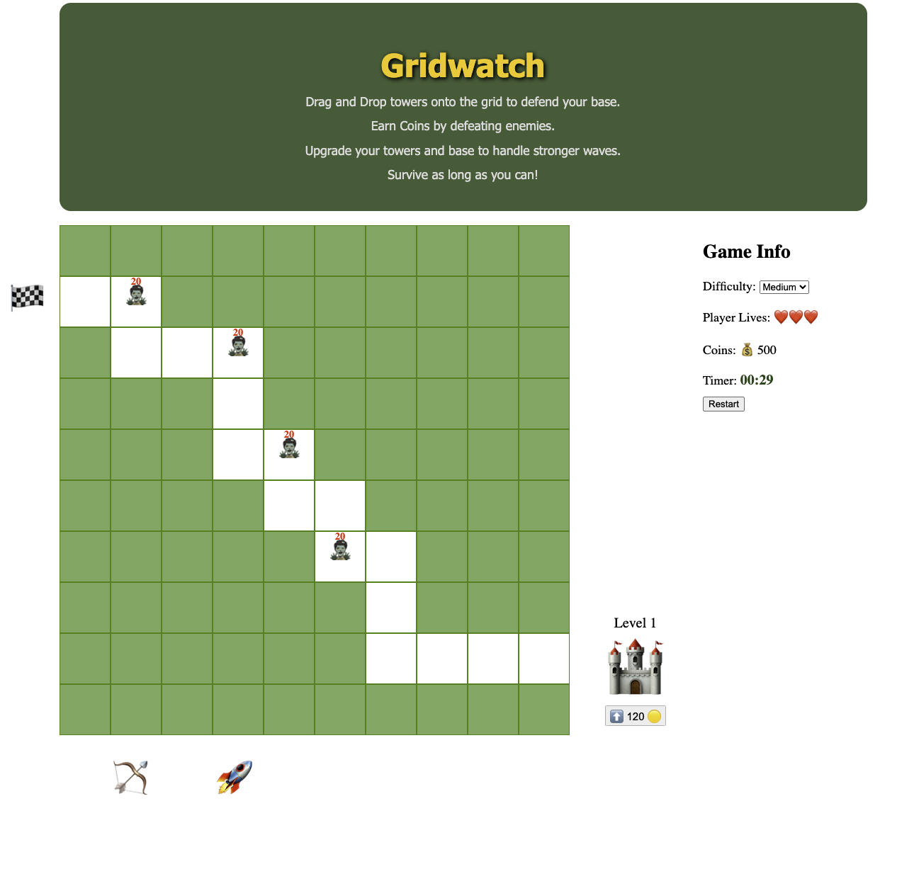
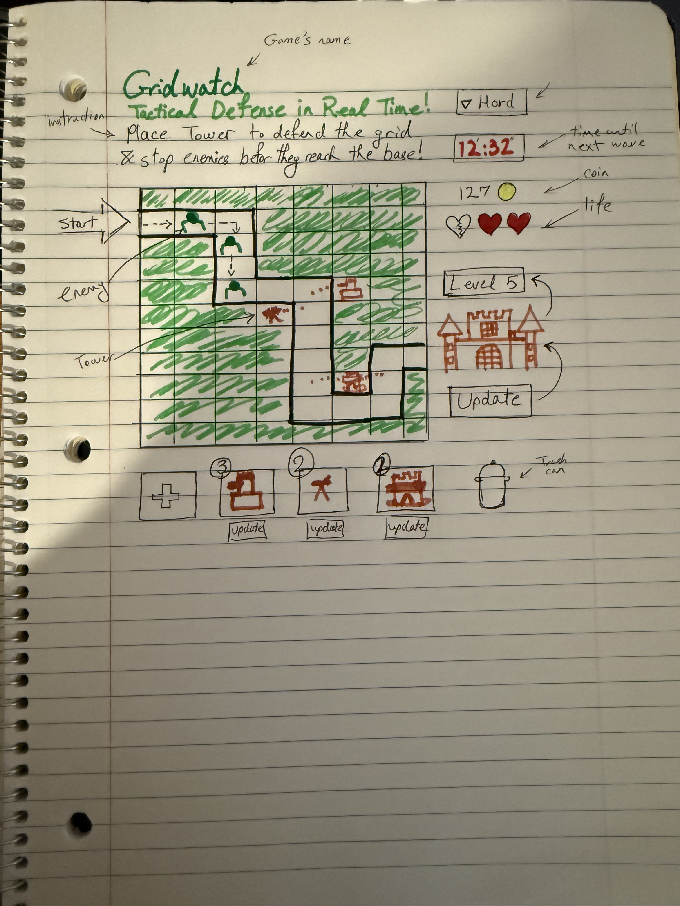

# Gridwatcher

## Game Description

**Gridwatcher** is a browser-based tower defense game where players strategically place different types of towers to stop waves of enemies from reaching the end of a path. Each wave gets progressively more difficult, and the player must balance defense and resource management. The objective is to survive as long as possible while upgrading the base and defending the grid.

I chose to build a tower defense game because it offered an ideal balance of creative freedom and technical complexity.

---

## Getting Started

**Live Site:** [Play Gridwatcher](https://biuregh.github.io/tower-defence-browser-based/)

### How to Play

- Drag and drop towers onto the grid to defend against incoming enemy waves.
- You start with 500 coins. Defeating enemies earns you additional coins.
- Use coins to place more towers and upgrade your base.
- The game ends when your lives reach zero.

### Planning Materials

---

## Technologies Used

- JavaScript (ES6+)
- HTML5
- CSS3
- DOM Manipulation
- `setInterval()` and `setTimeout()` for game logic

---

## Next Steps

Planned future enhancements include:

- Implementing a tower upgrade system
- Adding sound effects and background music
- Creating boss enemies with special behaviors
- Making the game responsive for mobile devices
- Adding more tower types with unique abilities
- Replacing the emojies with real png pictures
